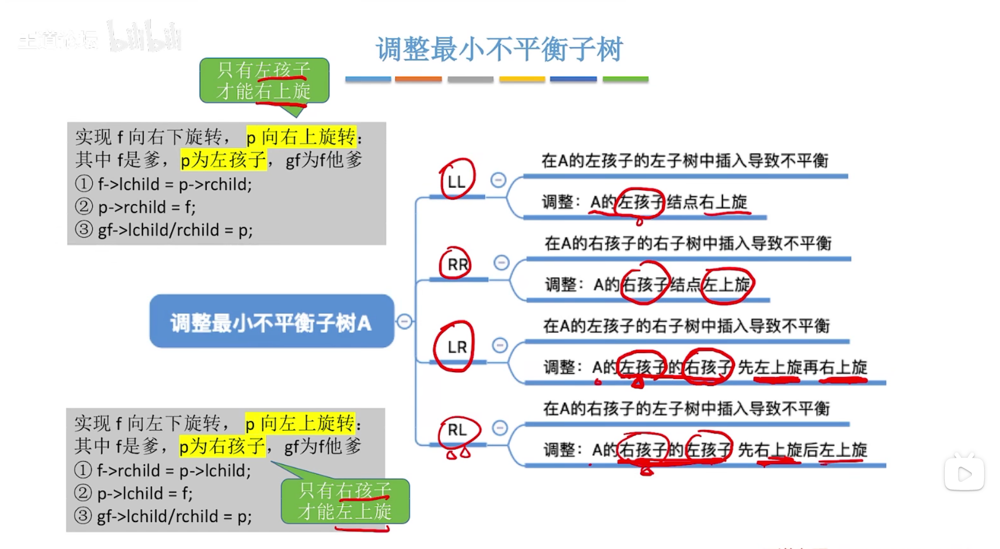
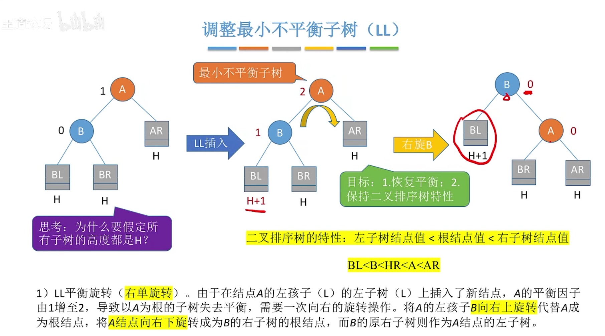
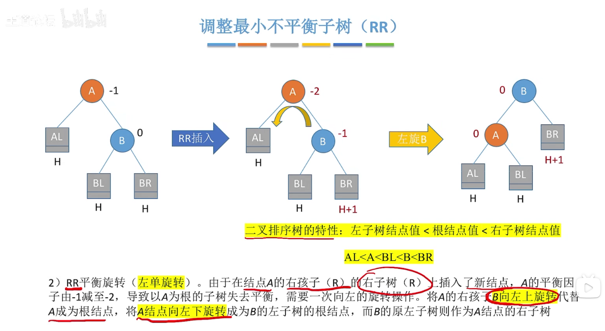
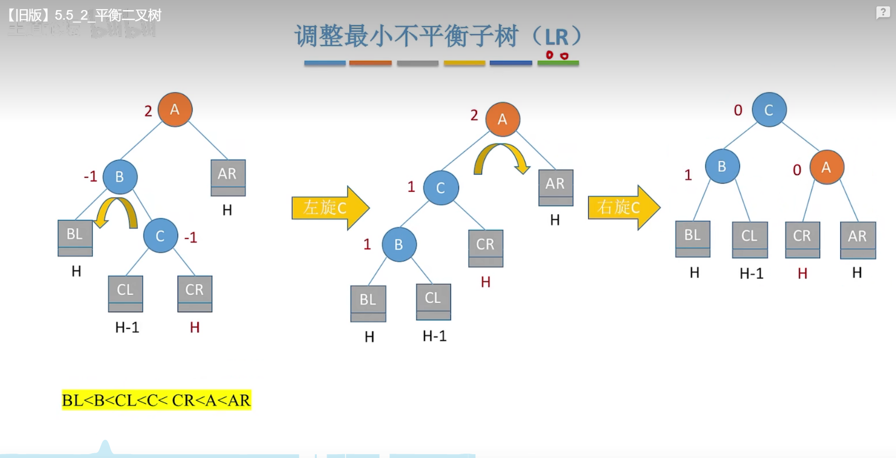
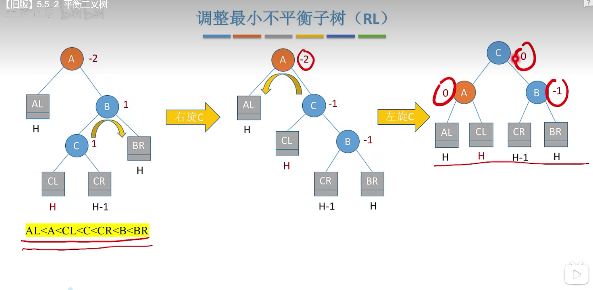
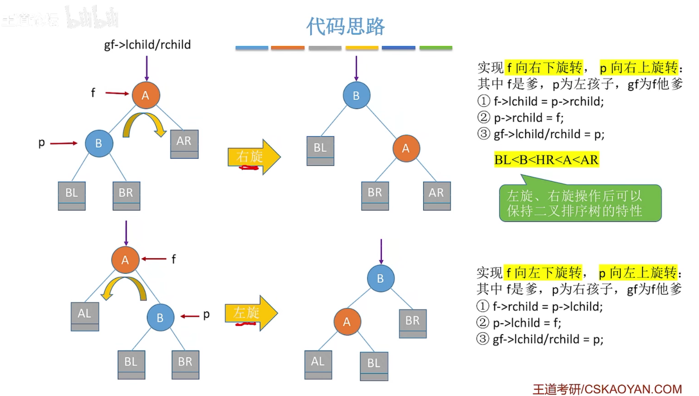
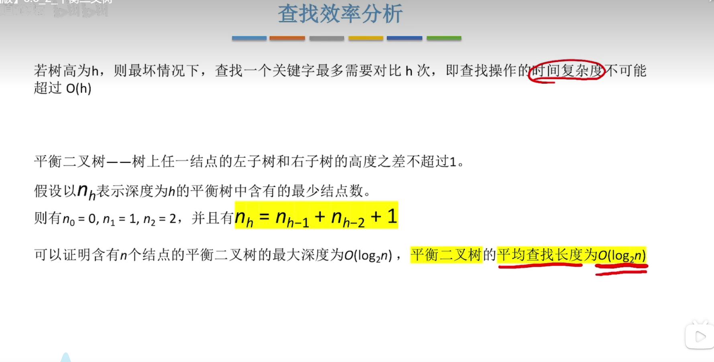
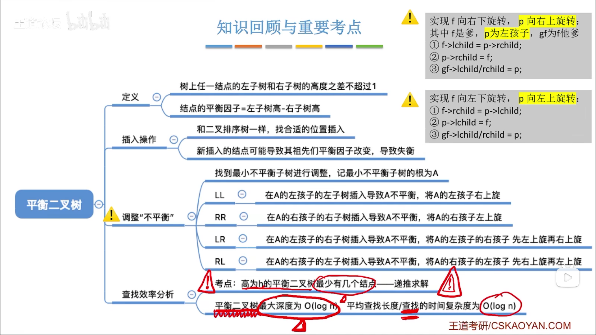

# 平衡二叉树

## 调整最小不平衡子树

### 1. LL 在A的左孩子的左子树中插入导致的不平衡

### 2. RR 在A的右孩子的右子树中插入导致的不平衡

### 3. LR 在A的左孩子的右子树中插入导致的不平衡

先左旋后右旋

### 4. RL 在A的右孩子的左子树中插入导致的不平衡

先右旋后左旋

### 左旋和右旋操作的代码实现

## 查找效率分析

根据Nh的递推公式可以算出深度为h的平衡二叉树含有的最少节点数

## 总结

